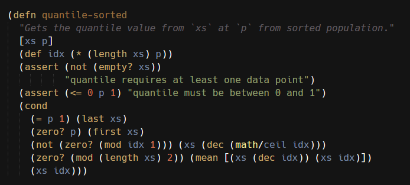
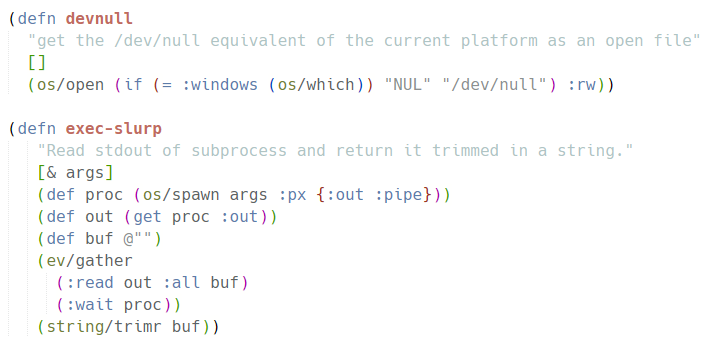

# Janet language support for Sublime Text

This package provides [Janet](https://janet-lang.org/) languge support and includes so far:

- syntax highlighting
- go to symbol navigation
- running Janet code right from the editor
- SublimeREPL integration

Work in progress.

## Screenshots

